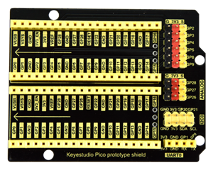
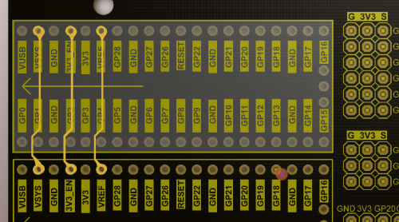

# KS3022 Keyestudio Pico IO Prototype Expansion Board

## 1. Description

The Keyestudio Pico IO prototype expansion board works with the Raspberry pico board. It can expand IO ports of the pico board. There are two IIC ports, a serial communication interface , three analog ports and six digital ports. This sensor board simplifies the circuit and makes it easy to connect with commonly used sensors. You can stack a Raspberry Pi pico board onto this shield.

## 2. Dimension

- Length, width and height: 69mm, 54mm, 12mm
- Weight: 22.7g